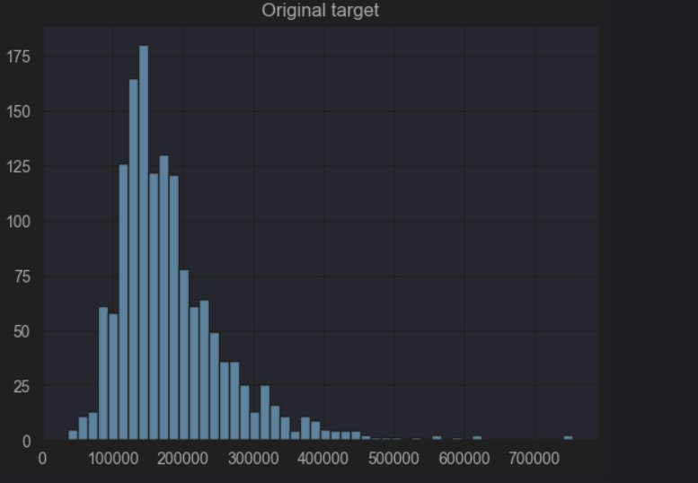
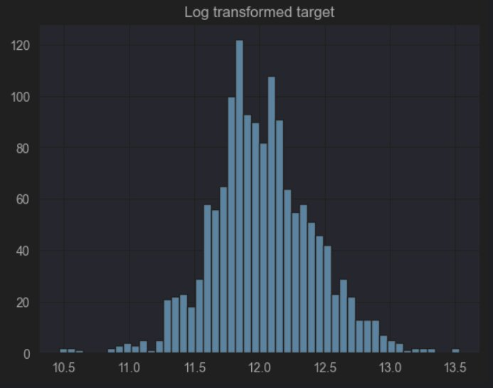
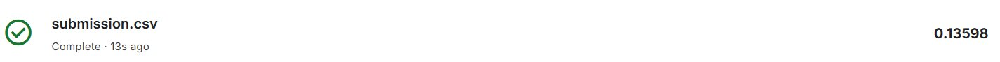

## რეპოზიტორიის სტრუქტურა

```
├── model_experiment.ipynb     # ძირითადი notebook: Cleaning, Feature Engineering, Feature Selection, Training, MLflow
├── model_inference.ipynb      # საუკეთესო მოდელის ჩამოტვირთვა Registry-დან და submission-ის გენერაცია
├── artifacts/                 # შენახული numpy მასივები (X_kaggle_aligned, kaggle_ids, X_kaggle_vt)
├── assets/                    # README-ში გამოყენებული სურათები
├── submission.csv             # Kaggle-ზე ატვირთული პროგნოზები
└── README.md                  # პროექტის დოკუმენტაცია
```

---

## ჩემი მიდგომა

პრობლემა გადავწყვიტე შემდეგი ეტაპობრივი მიდგომით: მონაცემების გასუფთავება → ახალი მახასიათებლების შექმნა → მახასიათებლების შერჩევა → მოდელების ტესტირება → საუკეთესო მოდელის რეგისტრაცია MLflow Model Registry-ში.

---

## Cleaning (მონაცემთა გასუფთავება)

პირველ ეტაპზე სვეტები ორ ჯგუფად დავყავი: კატეგორიულ (`object`) და რიცხვით ცვლადებად. კატეგორიულ სვეტებში არსებული გამოტოვებული მნიშვნელობები (NaN) შეივსო სტრიქონით — `"None"`, ხოლო რიცხვით სვეტებში — `0`-ით.
ეს პირველადი გასუფთავება სემანტიკური ხასიათის იყო: მოცემულ მონაცემებში NaN ხშირად ნიშნავს "არ არსებობს" და არა "ინფორმაცია გამოტოვებულია". მაგალითად, `GarageArea = NaN` მიუთითებს, რომ სახლს გარაჟი არ აქვს — მისი `0`-ით შევსება ლოგიკურად სწორია.
მეორე ეტაპზე დარჩენილი NaN მნიშვნელობები სტატისტიკური მეთოდებით შეივსო: რიცხვითი სვეტები — მედიანით, ხოლო კატეგორიული სვეტები — მოდით. მედიანა და მოდა გამოითვალა მხოლოდ `X_train`-ზე და შემდგომ გავრცელდა `X_test`-ზეც — ეს მიდგომა თავიდან გვაცილებს Data Leakage-ს.
კატეგორიული ცვლადები რიცხვით სახეში გადაყვანილ იქნა `pd.get_dummies(drop_first=True)` მეთოდით. `drop_first=True` გამოყენებულ იქნა მულტიკოლინეარობის თავიდან ასაცილებლად.

---

## Feature Engineering

### SalePrice-ის Log ტრანსფორმაცია

სამიზნე ცვლადი `SalePrice` ტრანსფორმირებულ იქნა `log1p` ფუნქციით — ანუ მოდელი ვსწავლობდი `log(SalePrice + 1)`-ზე და არა პირდაპირ ფასზე.

ამის მიზეზი ორია:

პირველი — ორიგინალი `SalePrice` განაწილება მკვეთრად right-skewed იყო: სახლების უმეტესობა $100,000–$200,000 დიაპაზონში იყო, მაგრამ იყო ექსტრემალური აუტლაიერები $700,000+-მდე. ასეთ განაწილებაზე ხაზოვანი მოდელი ცუდად მუშაობს, რადგან გამსხვილებული მნიშვნელობები კოეფიციენტებს "ამახინჯებს". Log ტრანსფორმაციის შემდეგ განაწილება სიმეტრიულთან მიახლოვდა.

მეორე — Kaggle-ის შეფასების მეტრიკა თავად RMSLE (Root Mean Squared Log Error) არის, ანუ log-სკალაზე ვარჯიში პირდაპირ ამ მეტრიკის ოპტიმიზაციას უტოლდება. პროგნოზის დროს `np.expm1` ფუნქციით ვბრუნდებით ორიგინალ სკალაზე.

| ორიგინალი განაწილება | Log-ტრანსფორმირებული |
|---|---|
|  |  |

---

საბაზისო ცვლადებზე დაყრდნობით შევქმენი 9 ახალი მახასიათებელი. თავდაპირველად მუშაობა შემდეგი ოთხი ცვლადით დავიწყე:

- **TotalSF:** სარდაფის, პირველი და მეორე სართულის ფართობების ჯამი. სახლის საერთო ფართობი ფასის ყველაზე ძლიერი პრედიქტორია.
- **HouseAge:** გაყიდვის წელს გამოკლებული აშენების წელი. ასაკი პირდაპირ აისახება ფასზე, თუმცა ორიგინალ მონაცემებში ეს ეფექტი ორ სხვადასხვა სვეტში იყო "დამალული".
- **HasGarage და HasBsmt:** ბინარული ცვლადები (0 ან 1). თუ `GarageArea > 0`, მენიჭება 1, წინააღმდეგ შემთხვევაში — 0. ანალოგიური პრინციპი გამოვიყენე `TotalBsmtSF`-ისთვისაც.

მოგვიანებით დავამატე კიდევ 5 მახასიათებელი:

- **TotalBath:** `FullBath + 0.5×HalfBath + BsmtFullBath + 0.5×BsmtHalfBath`. ოთხი სხვადასხვა სვეტი ერთ შეწონილ ჯამად გაერთიანდა.
- **TotalPorchSF:** ოთხი ტიპის გარე სივრცის ჯამი. ცალ-ცალკე ეს სვეტები sparse იყო (ბევრი ნულით), გაერთიანების შემდეგ კი უფრო ინფორმაციული გახდა.
- **IsRemodeled:** ბინარული ცვლადი. თუ `YearRemodAdd != YearBuilt`, ნიშნავს, რომ სახლი განახლებულია (1).
- **QualCond:** `OverallQual × OverallCond`. ინტერაქციის წევრი — გამრავლება ხარისხისა და მდგომარეობის ერთობლივ ეფექტს ასახავს.
- **LotAreaLog:** `LotArea` მკვეთრად right-skewed იყო, ამიტომ გამოვიყენე `log1p` ტრანსფორმაცია. ამან შეამცირა აუტლაიერების გავლენა და განაწილება სიმეტრიულთან გააახლოვა.

სხვა feature-ებითაც გავტესტე, მაგრამ უკეთესი შედეგი არ უჩვენებია, ამიტომ მხოლოდ ესენი დავტოვე.

---

## Feature Selection

გამოვიყენე 5 სხვადასხვა მიდგომა და შევადარე მათი შედეგები:

- **VarianceThreshold (0.01):** ამოიშალა თითქმის მუდმივი მნიშვნელობების მქონე სვეტები. ამ მიდგომამ საუკეთესო შედეგი აჩვენა: Test RMSE = 0.13598.
- **SelectKBest (k=100):** `f_regression` სქორინგით შეირჩა 100 საუკეთესო სვეტი. Test RMSE = 0.1390.
- **RFE (n=80):** LinearRegression-ზე დაფუძნებული recursive feature elimination. Test RMSE = 0.1812. მოხდა overfitting, რადგან RFE ზედმეტად მოერგო სატრენინგო მონაცემებს.
- **VT + RFE:** VarianceThreshold-ისა და RFE-ს კომბინაცია. Test RMSE = 0.1534.
- **RandomForest & Lasso Selection:** მახასიათებლების შერჩევა მათი importance-ისა და კოეფიციენტების მიხედვით.

თითოეულ selection-ს სხვადასხვა პარამეტრი შევუსაბამე. თავდაპირველად პირდაპირ ხელით ვტვირთავდი ამ ექსპერიმენტს, მაგრამ შემდეგ pipeline გამოვიყენე და მარტივად გავტესტე სხვა პარამეტრებიც.

საუკეთესო შედეგი VarianceThreshold-მა აჩვენა, რადგან მან ეფექტურად მოაცილა noise მოდელს.

---

## Training (მოდელირება)

გამოვცადე რამდენიმე ალგორითმი:

- **Linear Regression:** რეგულარიზაციის გარეშე მოდელმა აჩვენა overfitting (Test=0.1616). VT-ს გამოყენებით შედეგი გაუმჯობესდა (Test=0.13598).
- **Ridge (L2):** საუკეთესო შედეგი მივიღე `alpha=10`-ზე (Test=0.1371). რეგულარიზაციამ შეამცირა გადასწავლა კოეფიციენტების შეკუმშვით.
- **Lasso (L1):** საუკეთესო `alpha=0.0005` (Test=0.1395). Lasso-მ ზოგიერთი კოეფიციენტი ნულამდე დაიყვანა, რითაც ავტომატური feature selection მოახდინა.
- **RandomForest:** დაფიქსირდა overfitting (Train=0.07, Test=0.14). ხეები ზედმეტად მოერგო სატრენინგო მონაცემებს.
- **XGBoost & LightGBM:** გამოვცადე სხვადასხვა კონფიგურაცია. სპეციალურად შევქმენი `XGB_overfit_demo` (`max_depth=8, learning_rate=0.3`) და `XGB_underfit_demo` (`max_depth=2, learning_rate=0.5`) — პირველმა Train RMSE ძალიან დაბლა ჩამოიყვანა მაგრამ Test RMSE გაზარდა, მეორემ კი ორივე მაჩვენებელი მაღალი დატოვა. ოპტიმალური კონფიგურაცია (`n_estimators=500, learning_rate=0.05, max_depth=4`) Test RMSE ~0.14-ს აძლევდა.

ჰიპერპარამეტრების ოპტიმიზაცია: თავდაპირველად ვიყენებდი `run_and_log_experiment` ფუნქციას MLflow-სთან ერთად. მოგვიანებით გადავედი `Pipeline + GridSearchCV` მიდგომაზე, რაც პროცესს უფრო კომპაქტურს ხდის, თუმცა გამოთვლებისთვის მეტ დროს მოითხოვს.

საბოლოო შერჩევა: საუკეთესო მოდელად დასახელდა **LinearRegression + VarianceThreshold(0.01)**. მიუხედავად იმისა, რომ XGBoost და LightGBM უფრო მძლავრი მოდელებია, ამ მონაცემებზე LR+VT-მ აჩვენა საუკეთესო CV RMSE და ყველაზე სტაბილური განზოგადება. XGBoost-ის კონფიგურაციების უმეტესობა overfitting-ისკენ იხრებოდა.

---

## MLflow Tracking & Results

MLflow ექსპერიმენტების ბმული: https://dagshub.com/giomamaca/GitTest.mlflow

ექსპერიმენტების მონიტორინგი ხორციელდებოდა MLflow-ს მეშვეობით:

- **rmse_train:** ცდომილება სატრენინგო მონაცემებზე.
- **rmse_cv_mean:** 5-fold კროს-ვალიდაციის საშუალო RMSE (სტაბილურობის ინდიკატორი).
- **rmse_cv_std:** CV RMSE-ის სტანდარტული გადახრა.
- **rmse_test:** ვალიდაციურ (20%) მონაცემებზე მიღებული საბოლოო შეფასება.

შედეგი: საუკეთესო მოდელის CV RMSE = 0.1506, Test RMSE = 0.13598, Kaggle Public Score: 0.13598. საბოლოო submission-ისთვის მოდელი გადამზადდა სრულ სატრენინგო მონაცემებზე (`train.csv`) და შეინახა MLflow Model Registry-ში (`HousePrices_BestModel`).


